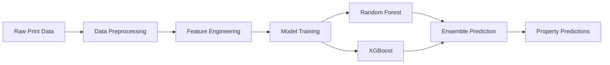

# 🏗️ Intelligent Forecasting in 3D Printing

<div align="center">
  
[](https://python.org/)
[](https://scikit-learn.org/)
[](https://xgboost.readthedocs.io/)
[](https://pandas.pydata.org/)

*A Machine Learning-powered solution to predict and enhance mechanical properties in additive manufacturing*

**What if you could print stronger, better 3D parts without all the guesswork?**

[🚀 Quick Start](#-quick-start) • [📊 How It Works](#-how-it-works) • [🎯 Real-World Impact](#-real-world-impact) • [📈 Results](#-results)

</div>

---

## 🌟 Overview

This project revolutionizes 3D printing by using **machine learning to predict mechanical properties** like tensile strength, hardness, and compressive strength based on your print parameters. Say goodbye to trial-and-error and hello to data-driven, optimized 3D printing!

### 🎯 Why This Matters

3D printing is powerful—but tuning it for strength and precision often feels like trial and error. Our intelligent system learns from real-world data to eliminate guesswork and helps you:

| Benefit | Impact |
|---------|--------|
| 🔍 **Smart Predictions** | Know how your 3D part will perform before hitting "print" |
| 🎯 **Optimized Settings** | Get intelligent suggestions for layer height, infill, and more |
| ♻️ **Resource Efficiency** | Reduce material waste and printing time significantly |
| 🛠️ **Enhanced Quality** | Build parts with superior strength, durability, and accuracy |
| 📚 **Deep Insights** | Understand how printing parameters truly affect your results |

---

## 📊 How It Works

Our system uses a **Random Forest model** (enhanced with XGBoost) trained on real experimental data. Simply input your desired print settings, and get instant predictions for:

<div align="center">

| Property | What It Tells You | Why It Matters |
|----------|-------------------|----------------|
| 🔧 **Tensile Strength** | Will it resist breaking when pulled? | Critical for load-bearing parts |
| 💎 **Hardness** | Can it handle wear and tear on the surface? | Essential for durability |
| 🏗️ **Compressive Strength** | Will it stand strong under pressure? | Vital for structural components |

</div>

---

## ⚙️ Input Parameters

### 🔧 Print Configuration Options

| Parameter | Description | Impact on Quality |
|-----------|-------------|-------------------|
| 🧪 **Material** | PLA, ABS, PETG, etc. | Each material behaves differently under stress |
| 📏 **Layer Height** | 0.1mm - 0.3mm typical range | Smaller = smoother finish, longer print time |
| 🔲 **Infill Density** | 0% - 100% internal fill | Higher density = stronger part, more material |
| 🌐 **Infill Pattern** | Grid, cubic, triangle, gyroid | Affects strength distribution and print speed |
| 📐 **Raster Orientation** | 0°, 45°, 90° layer directions | Critical for stress resistance direction |

---

## 🛠️ Tech Stack

<div align="center">

### Core Technologies

| Category | Technology | Purpose |
|----------|------------|---------|
| 🧠 **ML Framework** | Scikit-learn, XGBoost | Model training and prediction |
| 📊 **Data Processing** | Pandas, NumPy | Data preprocessing and analysis |
| 📈 **Visualization** | Matplotlib, Seaborn | Visual insights and model interpretation |
| 🐍 **Core Language** | Python 3.8+ | Main development platform |

</div>

---

## 🚀 Quick Start

### 1️⃣ Clone Repository
```bash
git clone https://github.com/yourusername/intelligent-3d-printing-forecasting
cd intelligent-3d-printing-forecasting
```

### 2️⃣ Setup Environment
```bash
# Create virtual environment
python -m venv venv
source venv/bin/activate  # On Windows: venv\Scripts\activate

# Install dependencies
pip install -r requirements.txt
```

### 3️⃣ Run Predictions
```python
from src.predictor import MechanicalPropertyPredictor

# Initialize predictor
predictor = MechanicalPropertyPredictor()

# Make predictions
results = predictor.predict({
    'material': 'PLA',
    'layer_height': 0.2,
    'infill_density': 20,
    'infill_pattern': 'cubic',
    'raster_orientation': 45
})

print(f"Predicted Tensile Strength: {results['tensile_strength']:.2f} MPa")
```

---

## 📈 Results & Visualizations

<div align="center">

### Model Performance Dashboard

<table>
<tr>
<td align="center">

<br><strong>🎯 Feature Importance</strong>
</td>
<td align="center">

<br><strong>🔧 Tensile Strength</strong>
</td>
<td align="center">

<br><strong>💎 Hardness Analysis</strong>
</td>
</tr>
<tr>
<td align="center">

<br><strong>🏗️ Compressive Strength</strong>
</td>
<td align="center">

<br><strong>⚙️ Parameter Optimization</strong>
</td>
<td align="center">

<br><strong>📊 Model Accuracy</strong>
</td>
</tr>
</table>

</div>

---

## 🎯 Real-World Impact

### 🌍 Industry Applications

| Sector | Application | Benefits |
|--------|-------------|----------|
| 🏭 **Industrial Manufacturing** | Production parts optimization | Stronger, cost-effective components |
| 🏥 **Medical Devices** | Critical healthcare components | Zero-failure tolerance applications |
| 🧪 **Education & Research** | Materials science learning | Hands-on understanding of material behavior |
| 🚀 **Rapid Prototyping** | Product development acceleration | Reduced iteration time and costs |

### 💡 Key Advantages

- **🎯 Precision**: Data-driven predictions eliminate guesswork
- **⏱️ Time Savings**: Optimize settings before printing
- **💰 Cost Reduction**: Minimize failed prints and material waste
- **🔬 Scientific Approach**: Evidence-based parameter selection
- **📈 Scalability**: Applicable across various materials and applications

---

## 🔬 Technical Deep Dive

### 🤖 Machine Learning Pipeline



### 📊 Model Architecture

- **Primary Model**: Random Forest (robust, interpretable)
- **Secondary Model**: XGBoost (high accuracy, gradient boosting)
- **Ensemble Method**: Weighted averaging for optimal predictions
- **Cross-Validation**: 5-fold CV for model validation

---

## 📚 Getting Started Guide

### 🎓 For Beginners
1. **Understand the Basics**: Learn about 3D printing parameters
2. **Explore Examples**: Run provided sample predictions
3. **Experiment**: Try different parameter combinations
4. **Analyze Results**: Study the prediction explanations

### 🔬 For Researchers
1. **Data Analysis**: Examine the training dataset
2. **Model Interpretation**: Use SHAP values for feature importance
3. **Custom Training**: Adapt model to your specific materials
4. **Validation**: Compare predictions with experimental results

### 🏭 For Industry Users
1. **Production Integration**: API endpoints for automated workflows
2. **Quality Control**: Batch prediction for production runs
3. **Cost Optimization**: Material and time efficiency analysis
4. **Custom Models**: Train on proprietary datasets

---

## 🤝 Contributing

We welcome contributions from the 3D printing and ML communities!

### 🎯 Ways to Contribute
- 🐛 **Bug Reports**: Help us identify and fix issues
- 🚀 **Feature Requests**: Suggest new functionality
- 📊 **Data Contributions**: Share experimental datasets
- 📚 **Documentation**: Improve guides and tutorials
- 🧪 **Testing**: Validate predictions with real prints


## 🙌 Let's Make 3D Printing Smarter


**🚀 Transform your 3D printing workflow today!**

</div>
